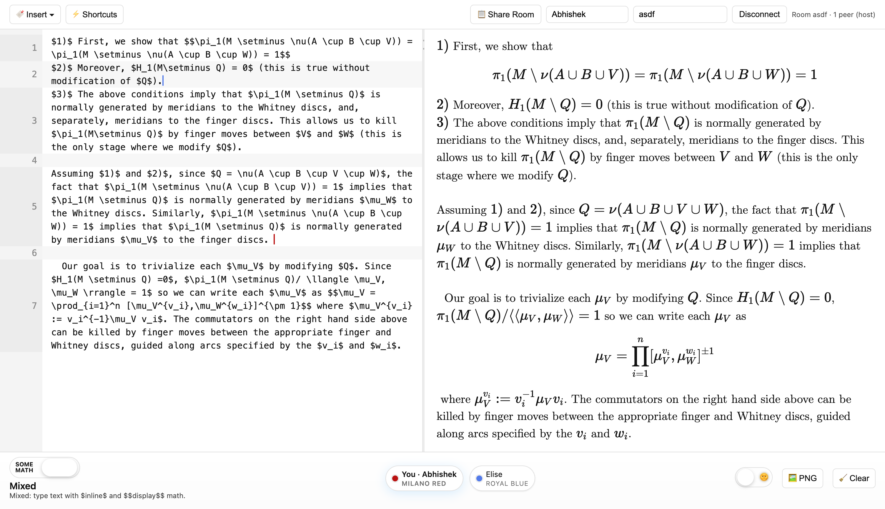

# LaTeX Lab

LaTeX Lab is a playful, zero‑setup workspace for typesetting math right in your browser. Open the page, start typing, and watch KaTeX render your work as you go. Now with realtime collaboration. ✨

## Quick Start 🚀
1. Open `latex_lab.html` for solo editing, or `latex_lab_trystero.html` to collaborate.
2. Type in the left editor. Use inline `$...$` or display `$$...$$` math in Mixed mode.
3. Flip the Mixed/Classic switch if you want each line rendered as display math.
4. Drag the divider to resize panes; double‑click it to snap back to center.

Everything (text, layout, theme, macros) saves locally so you can close the tab and pick up later.

## Realtime Collab 🤝

Open `latex_lab_trystero.html` to work together—no accounts or servers to set up.

- Presence pills with names show who’s here at a glance.
- Live remote carets with labels track where others are editing.
- Click your own presence pill to pick a color; your label and caret recolor instantly.
- Friendly color names via the xkcd list + nearest‑match lookup.
- Display name, color, and caret updates broadcast in real time.
- Status text shows connection health and who’s hosting.

Under the hood, Trystero handles the peer‑to‑peer room using several transports when available. Your text never goes through a hosted app server.

## Why You’ll Like It 💡
- Mixed or Classic flow – text‑first with inline math or equation‑only per line.
- Side‑by‑side focus – resize panes, double‑click to recenter, wrapping line numbers stay in sync.
- Dark mode on tap – match your lighting instantly.
- Sticks with you – text, macros, layout, cursor, and scroll position are restored each time you return.

## Key Features 🧰
- Live KaTeX preview with line‑aware gutters for long derivations.
- Mixed + Classic modes for note‑taking and equation‑only workflows.
- High‑resolution PNG export with embedded fonts.
- Shareable links that compress text, layout, theme, and macros into the URL.
- Dark mode toggle to match your workspace lighting instantly.
- Matrix, table, and cases builders that drop ready‑to‑edit snippets into the editor.
- Macros manager for pasting/saving your favorite `\newcommand` definitions.
- Keyboard‑friendly editing: smart Tab indent/outdent, paired bracket/dollar insertion, Esc to close modals.
- Resizable split view with persistent widths and scroll‑synced gutters.
- Auto‑save everywhere so text, cursor position, scroll offset, and layout are restored on reload.

## Collaboration Details 🔎
- Join by room name; peers appear as presence pills with colored dots.
- Your color is saved locally and can be changed anytime from your pill.
- Colors map to friendly names via the xkcd color list (nearest‑color match).
- Cursor, selection, name, and color changes are broadcast to peers.
- If the host changes, the status line and presence order update automatically.

## Tips & Tricks 🧪
- Use Shortcuts to paste multiple `\newcommand` lines—macros apply immediately.
- Insert ▾ launches matrix/table builders; adjust, then insert.
- Hit PNG after fonts finish loading for the cleanest export. If clipboard access is blocked when sharing, LaTeX Lab falls back to a copyable URL prompt.
- Fresh start? Clear wipes the editor and local save (with confirmation).

## Requirements 📦
LaTeX Lab is static HTML powered by CDN‑hosted KaTeX, html‑to‑image, and html2canvas. No build step, server, or installation—just open the file with internet access so assets can load. Collaboration uses peer‑to‑peer connections via Trystero.

Enjoy the lab bench! Tweak the HTML, refresh, and your changes appear immediately. 🧪

